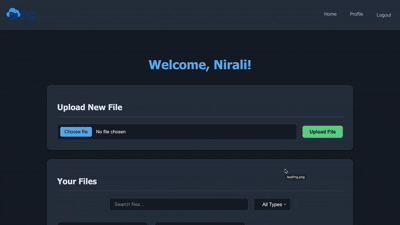
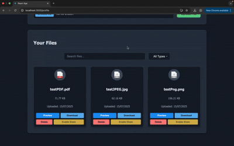
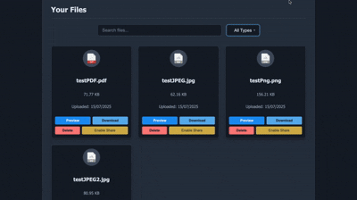
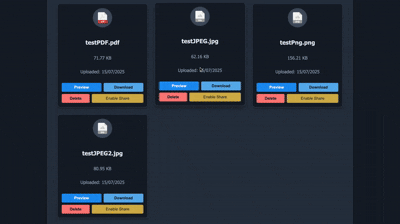

# ByteBridge - A Simple, not-at-all cluttered File Storage App

This project is a full-stack file storage solution similar to Dropbox, built with:

- **Backend**: Spring Boot
- **Frontend**: React
- **Database**: PostgreSQL
- **Dev Environment**: Docker Compose

---

## Local Setup

### Prerequisites

Ensure the following are installed on your machine:

- [Docker](https://www.docker.com/)
- [Docker Compose](https://docs.docker.com/compose/)

---

### Run the Entire App

The project uses Docker Compose to orchestrate backend, frontend, and database containers.

1. Clone this repo:

```bash
git clone https://github.com/nizz009/typeFace.git
cd typeFace
```

2. Start all services:

```bash
docker-compose up --build
```

> This command will:
> - Build and run the **backend** (Spring Boot)
> - Start the **frontend** dev server (React)
> - Launch a **PostgreSQL** database with initialized schema 

3. Open in Browser:

- Frontend: [http://localhost:3000](http://localhost:3000)
- Backend API: [http://localhost:8080/api](http://localhost:8080/api)
- Postgres: Running on port `5432`

---

### Project Structure

```
├── backend/        # Spring Boot app
├── frontend/       # React app
├── docker-compose.yml
└── README.md
```

---

### Notes

- Make sure port `3000`, `8080`, and `5432` are available before starting.
- All data is persisted via Docker volumes.
- React app supports hot-reloading for development.
- The maximum file size allow for file upload is set as 300MB but this can be updated by updating `MAX_FILE_SIZE` and `MAX_REQUEST_SIZE` in [docker-compose.yml](docker-compose.yml) file

---

### Cleanup

To stop all services:

```bash
docker-compose down
```

To remove volumes:

```bash
docker-compose down -v
```

---

## Features

### Upload and download files easily
  


### Preview files
Get a glimpse of your file in a separate tab with support for most common file formats



### Filter and search through files
Focus only the files you require by filtering them based on type and performing keyword-based search for efficient retrieval



### Share files ...or keep them hidden
Generate a shareable link to grant access to file preview to people with the link, and disable it anytime to revoke access.


  
## Tech Stack

- Spring Boot
- React (with Hooks)
- PostgreSQL
- Docker + Docker Compose
- JWT for Authentication

## Components

- Persistent storage is managed using Docker volumes for both uploaded files and PostgreSQL data.
- User authentication is implemented using JWT (JSON Web Tokens).

---

## License

This project is licensed under [MIT](LICENSE).